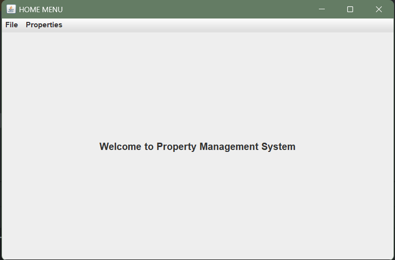
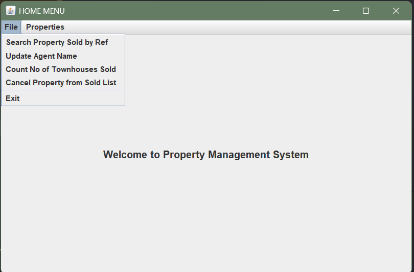
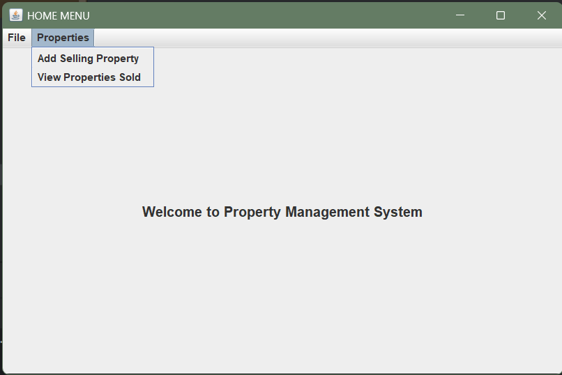
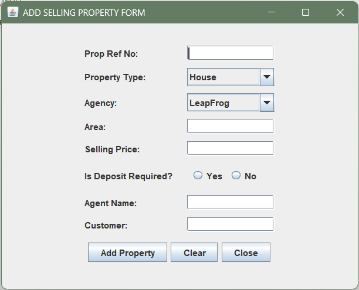
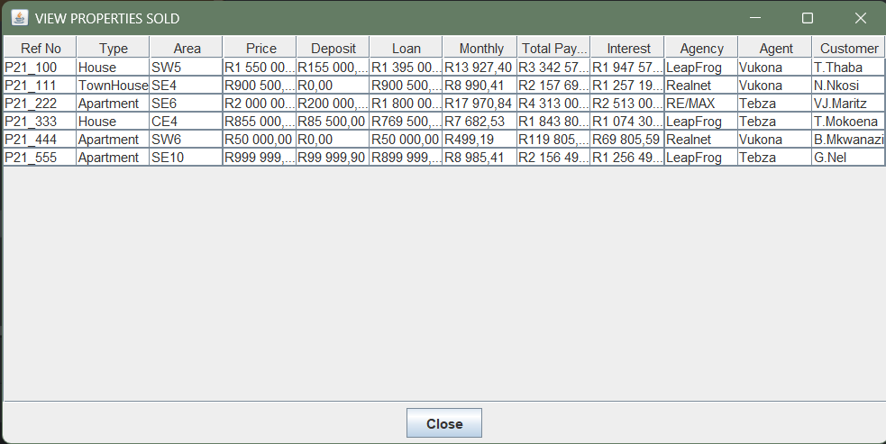

# Property Management System (Java)

A Java-based property management system with loan calculation, commission tracking, and GUI interface. Implements a three-tier architecture (Problem Domain, Data Access, GUI) with object stream persistence, custom exceptions, and Swing-based forms for managing sold properties.

## Architecture

- **Problem Domain (PD):**  
  Handles business logic including deposit calculation, loan amount, monthly installment, total payment, interest, and commission.

- **Data Access (DA):**  
  Manages storage and retrieval of property records using object streams (`property.dat`). Includes duplicate checks, search, update, delete, and count operations.

- **GUI (Swing):**  
  Two main screens:
  - `AddSellingProperty`: Form-based input with validation and exception handling.
  - `MainMenu`: Menu-driven interface for viewing, searching, updating, and managing properties.

## 💡 Features

- Add new property records with full validation
- Calculate deposit, loan, monthly repayment, total payment, and interest
- Track 5% commission per sale
- Search, update, and delete properties by reference number
- Count number of TownHouse properties sold
- View all sold properties in a formatted dashboard
- Save/load data using object serialization (`property.dat`)
- Exception handling with custom classes (`DuplicateException`, `NotFoundException`, `DataStorageException`)

## 🖥️ Technologies Used

- Java (JDK 8+)
- Swing (GUI)
- Object Streams (`ObjectInputStream`, `ObjectOutputStream`)
- Exception Handling
- Three-tier architecture

## Screenshots

 
 

## 🚀 How to Run

1. Clone the repository:
   git clone https://github.com/vukona-dev/property-management-java.git

2. Open in NetBeans or any Java IDE.

3. Run MainMenu.java to launch the application.

4. Use the GUI to add, view, and manage property records.

## File Structure

src/
├── Property.java
├── PropertyDA.java
├── PropertyPD.java
├── AddSellingProperty.java
├── MainMenu.java
├── DuplicateException.java
├── NotFoundException.java
└── DataStorageException.java

📄 License
